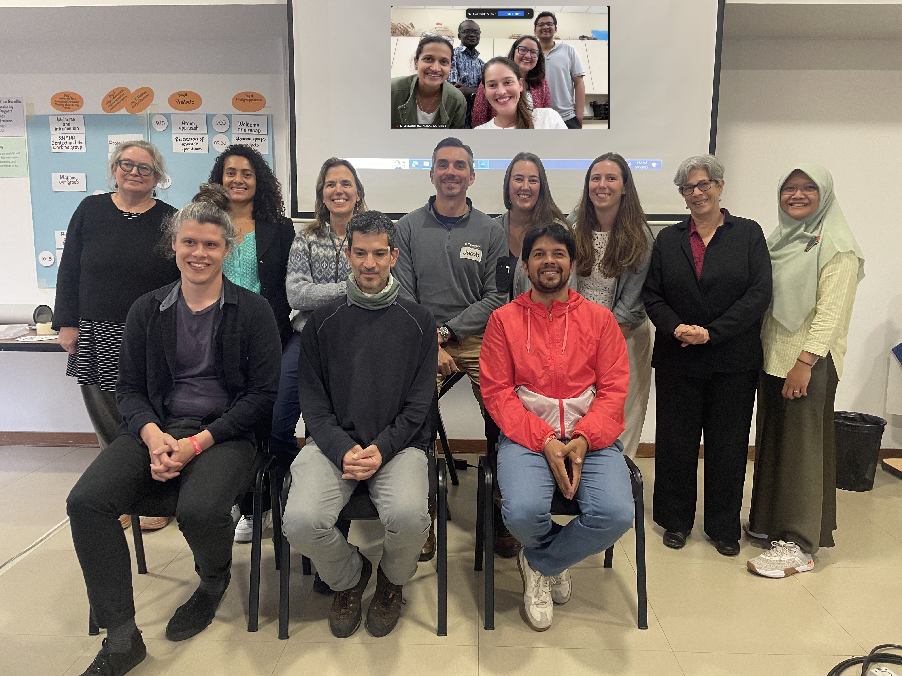
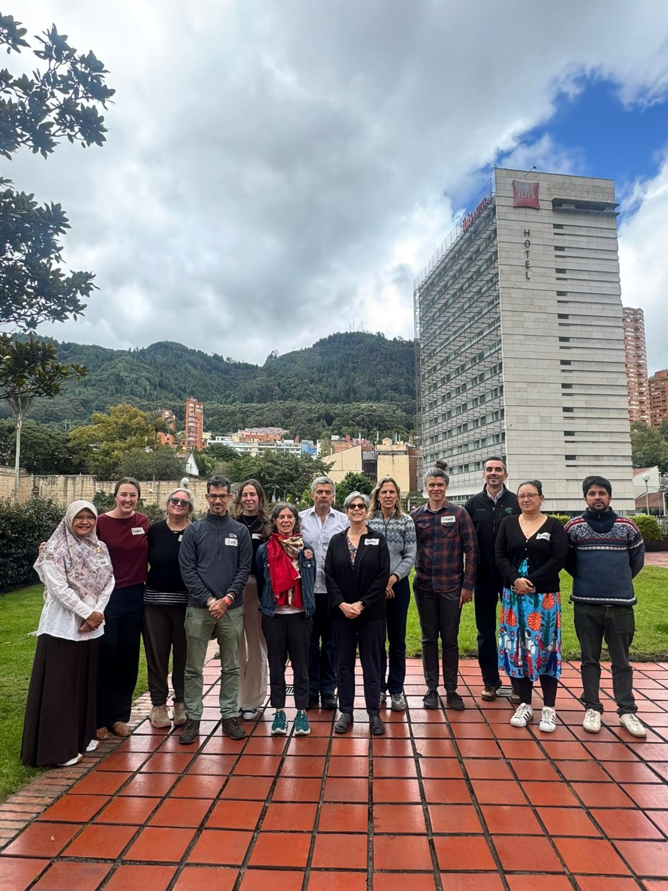

  
  

## Project Leads  

Laura Toro Gonzalez, *Missouri Botanical Garden*, [Lab Website](https://www.missouribotanicalgarden.org/plant-science/plant-science/about-science-conservation/research-staff/article/2878/toro-laura){:target="_blank"} <a href="mailto:ltoro@mobot.org">
  &#9993;
</a>  
Leland Werden, *ETH Zürich*, [LinkedIn](https://ch.linkedin.com/in/leland-werden){:target="_blank"} <a href="mailto:lwerden@gmail.com">
  &#9993;
</a>  
Manaswi Raghurama, *University of Minnesota*, [LinkedIn](https://www.linkedin.com/in/manaswi-raghurama-3566297a/){:target="_blank"} <a href="mailto:mraghura@umn.edu">
  &#9993;
</a>  
Jennifer Powers, *University of Minnesota*, [Lab Website](https://cbs.umn.edu/directory/jennifer-powers){:target="_blank"} <a href="mailto:powers@umn.edu">
  &#9993;
</a>  

## Members  

Shalom Addo-Danso, *Forest Research Institute of Ghana*, [Google Scholar](https://scholar.google.com/citations?user=4wO1U8EAAAAJ&hl=en){:target="_blank"}  
Pooja Choksi, *University of Minnesota*, [Website](https://poojachoksi.weebly.com/){:target="_blank"}  
Juliana Delgado, *The Nature Conservancy*, [Google Scholar](https://scholar.google.com/citations?user=LjCHc00AAAAJ&hl=en){:target="_blank"}  
Isabel Hillman, *Conservation International*, [LinkedIn](https://www.linkedin.com/in/isabelhillman){:target="_blank"}  
Sara Löfqvist, *ETH Zurich*, [LinkedIn](https://ch.linkedin.com/in/sara-l%C3%B6fqvist-635b0a101){:target="_blank"}  
Cristy Portales-Reyes, *Saint Louis University*, [Lab Website](https://portalesbiodiversitylab.com/){:target="_blank"}  
David Reyes, *Ministerio de Ambiente y Energia, Costa Rica*, [LinkedIn](https://cr.linkedin.com/in/david-reyes-cordero-96b80a72){:target="_blank"}  
Silvia Secchi, *University of Iowa*, [Website](https://ssecchi.wixsite.com/mysite){:target="_blank"}  
Jacob Slusser, *ELTI (Environmental Leadership & Training Initiative), Yale School of the Environment*, [LinkedIn](https://www.linkedin.com/in/jacob-l-slusser-228b1624/){:target="_blank"}  
Depi Susilawati, *Australian National University*, [Google Scholar](https://scholar.google.com/citations?user=SA9QrCsAAAAJ&hl=en){:target="_blank"}  
Selene Torres, *Wildlife Conservation Society*, [LinkedIn](https://co.linkedin.com/in/selenetorres){:target="_blank"}  
Zak Zahawi, *Charles Darwin Foundation*, [Website](https://rzahawi.wordpress.com/){:target="_blank"}

## Advisors  

Pedro Brancalion, *University of Sao Paulo*, [Google Scholar](https://scholar.google.com/citations?user=0f_YV1wAAAAJ&hl=pt-BR){:target="_blank"}  
Lyndall Bull, *Food and Agricultural Organization*, [LinkedIn](https://it.linkedin.com/in/lyndall-bull-1b341a12){:target="_blank"}  
Robin Chazdon, *University of the Sunshine Coast and World Resources Institute*, [LinkedIn](https://www.linkedin.com/in/robin-chazdon-96218a59){:target="_blank"}  
Susan Cook-Patton, *The Nature Conservancy*, [LinkedIn](https://www.linkedin.com/in/susan-cook-patton-ph-d-3904a448){:target="_blank"}  
Eva Garen, *Environmental Leadership and Training Initiative*, [LinkedIn](https://www.linkedin.com/in/eva-garen-ph-d-0b358713){:target="_blank"}  
Karen Holl, *University of California, Santa Cruz*, [Lab Website](http://www.holl-lab.com/store/c1/Featured_Products.html){:target="_blank"}
